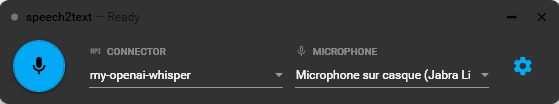

# speech2text

A lightweight Windows dictation app that replaces the native Win+H shortcut with AI-powered transcription.

## Motivation

Windows has a built-in dictation feature triggered by `Win+H`. While the concept is great — press a shortcut, speak, get text injected wherever your cursor is — the transcription quality is poor. In 2026, with the maturity of AI-based speech recognition models, there is no excuse for mediocre results. This app keeps the same frictionless experience while leveraging modern transcription services (Azure OpenAI / Whisper) for dramatically better accuracy.

  

## What it does

- Global keyboard shortcut (`Ctrl+Shift+R` by default) to start/stop recording
- Transcribed text is injected at the cursor position, in any application
- Minimal floating overlay with quick access to configuration
- Supports multiple named transcription profiles (e.g. one per language)
- Configurable audio input device
- Press `Escape` during recording to cancel without transcribing; press `Escape` at any other time to minimize to tray

## Installation

Download the latest `speech2text.exe` from the [Releases](../../releases) page and place it anywhere on your machine. No installer required — the app is self-contained.

### Launch at Windows startup

The app does not yet have a built-in "launch at startup" option. In the meantime, you can set it up manually using the Windows Startup folder:

1. Press `Win + R`, type `shell:startup` and press Enter — this opens your personal Startup folder
2. Create a shortcut to `speech2text.exe` in that folder (right-click → New → Shortcut)

The app will now launch automatically every time you log in. To disable it, delete the shortcut from that folder, or go to **Settings → Apps → Startup** and toggle it off.

## Status

Current version is basic but works great. See remaining improvements to be implemented for the next releases in the RoadMap file.
